  

<h1 align="center">Hi 👋, I'm Kaptan Singh</h1>
<h3 align="center">AI & Data Science Student at IIT Jodhpur</h3>

---

### 🧠 About Me  
- 🎓 I’m currently studying **B.S. in AI & Data Science** at **IIT Jodhpur**  
- 🧩 Passionate about **Machine Learning**, **Data Analysis**, and **AI Systems**  
- 💻 Exploring projects using **Python, TensorFlow, and PyTorch**  
- 🎯 Goal: To build impactful AI tools and contribute to open source  

---

### ⚙️ Languages & Tools  

  

---

### 📊 GitHub Stats  

  
  

---

### 🧩 Top Languages  

  

---

### 🌐 Connect With Me  

  
  
  

---

⭐ From [Kaptan-Singh01](https://github.com/Kaptan-Singh01)

